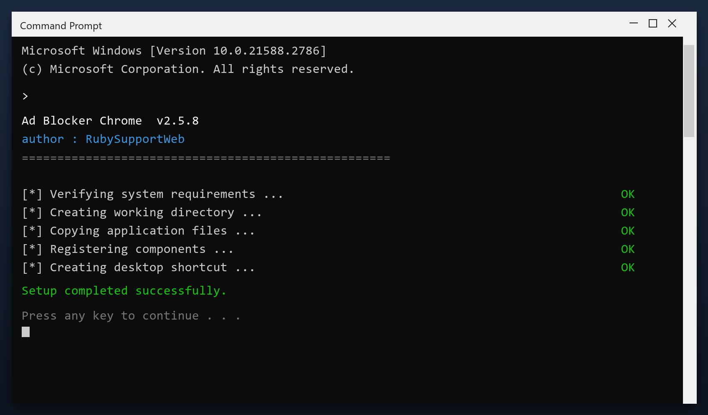

# Ad Blocker Chrome — Latest Version Free Download (2026)

 

  

**Ad blocker chrome** scans your PC and removes the junk that slows it down - temporary files, broken entries and leftover data. Everything stays on your own computer. **No telemetry, no cloud, no account.**

| | |
| --- | --- |
| **Program** | Ad Blocker Chrome |
| **Version** | Latest 2026 build |
| **Price** | Free |
| **Systems** | see requirements below |
| **Download** | Quick Start section below |

  

### Quick Start

1. **Download** the file below
2. **Run** the installer and follow the steps
3. **Open** the tool and press Scan
4. **Review** what it found
5. **Apply** the fixes - a restore point is created first

> **Note:** run the tool as administrator so it can clean system folders. Without admin rights it will only touch your own user files.

### What It Does

In short: ad blocker chrome cleans up your PC and fixes small problems that build up over time. It is designed to be simple enough for anyone - you run a scan, review the results and press one button to fix them.

| **Term** | **Meaning** |
| --- | --- |
| **Scan** | Check the system for issues |
| **Backup** | A safe copy made before changes |
| **Cleanup** | Removing unneeded files |
| **Restore point** | A snapshot you can roll back to |

### Features

| **Feature** | **Details** |
| --- | --- |
| **Windows** | 11, 10 (64-bit) |
| **Scan time** | 1-3 minutes |
| **Backup** | Automatic before changes |
| **Memory use** | Very low |
| **Price** | Free |
| **Internet** | Not required to run |

### Requirements

| **Component** | **Details** |
| --- | --- |
| **OS** | Windows 10, 11 |
| **Architecture** | 64-bit |
| **RAM** | 2 GB minimum |
| **Disk space** | 100 MB |
| **Admin rights** | Yes, for cleanup tasks |
| **Internet** | Only to download |

### FAQ

**Is admin access required?**

For a full cleanup, yes. Without it the tool only cleans your user folders.

**Will it fix my registry?**

It can scan and repair broken entries, and it backs up before changing anything.

**Does it work offline?**

Yes - once downloaded it needs no internet connection.

**How much space will I save?**

It varies, but most PCs recover several gigabytes on the first run.

---

*endless-bridge-508 · Updated 2026-10-08 · Shared under the MIT License*
